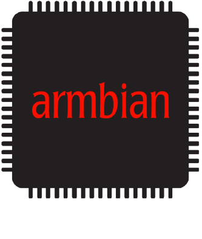

# Unofficial Armbian build for Makerbase [MKS PI](https://github.com/makerbase-mks/MKS-PI) and [MKS SKIPR](https://github.com/makerbase-mks/MKS-SKIPR) and few more boards

TLTR: Unofficial support of Makerbase MKS PI and MKS SKIPR and other boards. Contains `mkspi` board declaration and related kernel and u-boot patches.  
Please note, result Armbian image is not full replacement for mks distributed image. You have to do yourself all OS configuration and and Klipper components installation.  

**WIP, absolutely no guarantees, you do everything at your own risk.**  


## Bit of Liric

The MKS-PI ads look good, especially considering the price and the display (e.g. the size fits the Ghost Flying Bear printer). However, the software and support from the manufacturer is terrible.   

There is no source code (yeah, GPL license, of course), no answer to questions, etc. They provide preconfigured Armbian+Klipper, but the image contains random/outdated components and I have problems with WIFI adapters. And who knows what else is hidden in there.    

So the idea was to build a normal Armbian image using the available information (provided patches, circuitry and information from the native image).   


## Goals

Prepare an Armbian build with `current` and `edge` kernels that is ready to install Klipper from scratch.     

Please note:

* Klipper, Fluid and other related components are outside the scope of this repo. Please see [Klipper Installation And Update Helper (KIAUH)](https://github.com/dw-0/kiauh) if you are interested in these topics.
* The original patches were taken from the [Makerbase `armbian-build` repository](https://github.com/makerbase-mks/armbian-build), this means you have to be mentally ready to see ~~this mess~~ "fast and dirty" approach. I do not have enough knowledge and time to organize this mess in the right way. 
* I do not have access to full MKS PI set and cannot test all features. Main goal is to have worked on the following component:
  * booting from microSD
  * MKSPI-TS35 TFT display (ideally with working touch screen :) )
  * worked HDMI output
  * USB ports, including USB 3 port
  * ADXL345 (SPI bus)
  * CAN bus for SKIPR board
* Feel free to get involved in development, testing or hardware support if you are interested in additional features.
* ~~At the moment I only focus on Ubuntu LTS builds (`current` and `edge` kernels). Feel free to open PRs if you need non-LTS Ubuntu or Debian images.~~ Ubuntu LTS (tested) and Debian Bullseye (untested) builds are supported.

Feel free to discuss or just open PRs if you know the right way to orgonize these patches and the right places in the Armbian sources.


## Current status

Supported boards:
* [MKS PI](https://github.com/makerbase-mks/MKS-PI) - fully supported
* [MKS SKIPR](https://github.com/makerbase-mks/MKS-SKIPR) - fully supported
* QIDI X-4 and X-6 Mainboards (made by MKS for X-Plus 3 and X-Max 3) - partially supported. See [FreeQIDI](https://github.com/Phil1988/FreeQIDI) and https://github.com/redrathnure/armbian-mkspi/issues/21 for more details.

MKS IPS50 LCD (with native 800x480 resolution) - supported starting from `0.3.1-24.2.0-trunk` version. The screen must be connected before system boot.
External monitors via HDMI - supported if sreen provides valid EDID data. In the case of non-standard resolutions, the functionality may be broken.

Starting with `0.3.2-24.2.0-trunk', a `build-essential' and kernel header package are bundled into the image. It should simplify Klipper installation and custom kernel module building (e.g. WIFI modules like [RTL8188GU (RTL8710B)](https://github.com/McMCCRU/rtl8188gu) one).

When the board boots from EMMC card and ADXL345 sensor is connected (SPI bus), [MKSPI-TS35 TFT display may not work (white screen)](https://github.com/makerbase-mks/MKS-PI/issues/14). Possible ~~solutions~~ workarounds:
 * boot from microSD card
 * short ADXL345 cables and reduce MKSPI-TS35 SPI bus clock speed
 * connect accelerometer sensor via USB, toolhead or any other "non SPI0" interface
 * connect ADXL345 board only when it's needed
 * use HDMI-connected display

The images should be ready for use on a daily basis. However, please note the following:

1. Only latest LTS Ubuntu images are actively tested. Please use the Debian ones at your own risk.
2. Bugs may appear from time to time. Especially it related to edge images. Please check [release page](https://github.com/redrathnure/armbian-mkspi/releases) for more details and feel free [to report an issue](https://github.com/redrathnure/armbian-mkspi/issues).
3. Please double check a [How to Configure CAN Bus](#how-to-configure-can-bus) section  if you are using the [BTT EBB36](https://github.com/bigtreetech/EBB) or similar CAN toolhead


### ADXL345/SPI Usage

TLTR: Do not forget about [klipper_mcu installation](https://www.klipper3d.org/RPi_microcontroller.html).

Full version:

* Step 0: Ensure spidev device exists. e.g. `ls -al /dev/spi*` should show `/dev/spidev0.2` device file
* Step 1: Install Klipper. E.g. 
	```
	cd ~
	git clone https://github.com/th33xitus/kiauh.git
	./kiauh/kiauh.sh
	```
	,  then 1, 1, 1 and so on.
* Step 2: Build and install `klipper_mcu` service
	```
	# Build and install klipper_mcu binary
	cd ~/klipper/
	
	# In the menu, set "Microcontroller Architecture" to "Linux process," then save and exit.
	make menuconfig
	
	# Preapre klipper-mcu service 
	sudo ln -s $PWD/scripts/klipper-mcu.service /etc/systemd/system/
	sudo systemctl daemon-reload
	sudo systemctl enable klipper-mcu.service

	# Stop klipper service and install klipper-mcu binary file
	sudo service klipper stop
	make flash

	# Start klipper_mcu and klipper
	sudo systemctl start klipper-mcu klipper-mcu
	
	# Ensure everything is up and running
	sudo systemctl status klipper-mcu klipper
	```
* Step 3: [Add adxl345 configuration to your `printer.cfg`](https://github.com/makerbase-mks/MKS-PI#adxl345-connection-and-configuration)


### Package Updates via Apt Update

Please double check kernel packages are freezed before running `apt update` command. E.g. run `sudo armbian-config` and check `System` -> `Freeze - Disable Armbian kernel updates` item.


### How to Rotate Screen

Sometimes you need to rotate the image on the screen, for example, when upgrading Flying Bear Ghost 5 printer. To do this you need to change value for `rotate` parameter under `spi_for_lcd@0` section (configuration for the display) and use `touchscreen-inverted-x = <0x01>` and/or `touchscreen-inverted-y = <0x01>` parameters for `spi_for_touch@1` section (configuration for touchscreen) in `/boot/dtb/rockchip/rk3328-roc-cc.dtb` file. Please note, value for `touchscreen-inverted-x = <0x01>` or `touchscreen-inverted-y = <0x01>` does *not* affect anything. To disable e.g. y-inversion, whole parameter should be commented out (`# touchscreen-inverted-y = <0x01>;`). There are few examples:

* 270° (default mode) - `rotate = <270>;` (or `rotate = <0x10e>;` and `touchscreen-inverted-y = <0x01>`
* 90° (flipped horizontally) - `rotate = <90>;` and `touchscreen-inverted-x = <0x01>`

Following commands may be used to perform this configuration:
```
# Backup
sudo cp /boot/dtb/rockchip/rk3328-roc-cc.dtb /boot/dtb/rockchip/rk3328-roc-cc.dtb.$(date +"%Y%m%d_%H%M%S").bak
# Unpack DTB file
sudo dtc -I dtb -O dts -o rk3328-roc-cc.dts /boot/dtb/rockchip/rk3328-roc-cc.dtb
#Make a copy to work with
sudo cp rk3328-roc-cc.dts rk3328-roc-cc-rotated.dts

# Find `rotate = <SOME_VALUE>` and change to `rotate = <NEW_VALUE>`, where NEW_VALUE is a rotation angle, e.g. `rotate = <90>` or `rotate = <270>`
# Then find `touchscreen-inverted-y` attribute and add or replace `touchscreen-inverted-x` one
nano rk3328-roc-cc-rotated.dts

# Or sed -i -e "s/<0x10e>/<90>/g" rk3328-roc-cc-rotated.dts
# and sed -i -e "s/touchscreen-inverted-y/touchscreen-inverted-x/g" rk3328-roc-cc-rotated.dts

# Double check
less rk3328-roc-cc-rotated.dts | grep rotate
less rk3328-roc-cc-rotated.dts | grep touchscreen-inverted

# Pack DTS to DTB
dtc -I dts -O dtb -o rk3328-roc-cc-rotated.dtb rk3328-roc-cc-rotated.dts

# Update rk3328-roc-cc.dtb with new version
sudo cp rk3328-roc-cc-rotated.dtb /boot/dtb/rockchip/rk3328-roc-cc.dtb

# Reboot
sudo reboot
```


### How to Configure CAN Bus

There are few non-obvious points that you should be aware of to successfully configure the CAN bus:

1. MKS SKIPR board must be connected via USB (UART connection does not work for CAN bridge mode)
2. By default latest images/Ubuntu distros do not have `ifconfig` command out of the box, so [Klipper documentation -- USB to CAN bus bridge mode](https://www.klipper3d.org/CANBUS.html#usb-to-can-bus-bridge-mode) will not properly work.
3. Starting from `0.4.0-24.11.0-trunk` image, Ubuntu and Debian distro use NetworkManager by default, which means `/etc/network/interfaces.d/*` files have no effect anymore. So CANbus must be consfigured via Systemd-Networkd (see text bellow). It's OK to use NetworkManager for KlipperScreen to manage WIFI and Ethernet interfaces, and Systemd-Networkd for the CANbus interface at the same time.  

Steps to configure CAN bus:

1. (For SKIPR board) hook MCU via USB cable ("USB to CAN bus bridge" is not supported for UART connection type).
2. (For SKIPR board) [compile Klipper firmware](https://klipper.discourse.group/t/mks-skipr-can-bus/5377/16) and flash MCU. Please specify bitrate/speed which will be used for toolhead. USuallu 500 000 or 1 000 000.
3. Configure `can0` interface on MKSPI
3.1. Debian Interfaces file. Only for old distros, pre `0.4.0-24.11.0-trunk` images:
   ```
    cat <<-'EOF' | sudo tee -a /etc/network/interfaces.d/can0
	allow-hotplug can0
	iface can0 can static
		bitrate 1000000                                       # Ensure it's the same as selected for MCU firmware.
		# up ifconfig $IFACE txqueuelen 128                   # It will not work because no ifconfig installed by default...
		up ip link set $IFACE txqueuelen 128                  # ... please use this version instead. 
		#up ip link set $IFACE txqueuelen 1024 restart-ms 200 # Bit more aggressive configuration

	EOF
   ``` 
3.2. Systemd-Networkd, for modern distros,  starting with `0.4.0-24.11.0-trunk` images:
   ```
    cat <<-'EOF' | sudo tee /etc/systemd/network/80-can0.network
	[Match]
	Name=can0

	[CAN]
	BitRate=1M
	RestartSec=200ms
	# see also https://www.freedesktop.org/software/systemd/man/latest/systemd.network.html#[CAN]%20Section%20Options


	[Link]
	TransmitQueueLength=1024
	# see also https://www.freedesktop.org/software/systemd/man/latest/systemd.network.html#%5BLink%5D%20Section%20Options

	EOF
	
	sudo systemctl enable systemd-networkd
	sudo systemctl start systemd-networkd
	sudo systemctl status systemd-networkd
   ``` 
4. Reboot. Yes, it's important! 
5. Hook a toolhead board, find connected devices `~/klippy-env/bin/python ~/klipper/scripts/canbus_query.py can0` and follow [Klipper documentation -- USB to CAN bus bridge mode](https://www.klipper3d.org/CANBUS.html#usb-to-can-bus-bridge-mode) for the rest of configuration.


In case of `MCU 'mcu' shutdown: Timer too close`, `b'Got error -1 in can write: (105)No buffer space available'` or similar troubles, please try following steps:

Step 1. Use `ip -s link show can0` or/and [Moonraker -> Settings -> MCU status](https://www.teamfdm.com/forums/topic/1524-debugging-canbus-and-communication-timeout-while-homingbytes_invalid/#comment-9910) to ensure no error/invalid AND no retransmit packages. In case of error/invalid packages please see `Step 2`. In case of no error but increasing retransmit packages please refer `Step 3`.

Step 2: double check wiring and terminal resistor. A twisted pair for data signals (CAN_L & CAN_H) is almost required for line longer that 20cm.

Step 3. Ensure `sudo systemctl --failed` does not show failed units. (Outdated, for Debian Interfaces file only) Otherwice doble check `/etc/network/interfaces.d/can0` and ensure that `ifconfig` command (from the Klipper documentation) is *not* used. `if@can0` unit must start without any issues.


### Disable Debug Console UART2  or Freeup UART1 Interface

By default UART2 is used for the kernel debug output (ttyS2, USB Type C connection). Please disable kernel console and double check device file permissions if you need the ttyS2 for any other purposes:

```
# Or just add console=none to /boot/armbianEnv.txt manually.
echo 'console=none' > sudo tee -a /boot/armbianEnv.txt

# Grant user permissions and prevent getty from taking over the port
echo 'KERNEL=="ttyS2",MODE="0660"' > /etc/udev/rules.d/99-ttyS2.rules
systemctl mask serial-getty@ttyS2.service
```

A `mkspi-uart1` overlay may be used to disable LCD and Touchscreen intefraces and freeup UART1/ttyS1 for custom purposes. e.g. by adding `overlays=mkspi-uart1` string to `/boot/armbianEnv.txt` file.

This solution was tested on  QIDI X-7 (Q1 Pro mainboard) and X-6 printers. Please see [Disable kernel console debug messages for ttyS2 #31](https://github.com/redrathnure/armbian-mkspi/issues/31) for more details.


## How to Build

The new `mkspi` board was declared. Now has support only for `current` and `edge` kernels and Ubuntu Jammy (22.04) and Noble (24.04) OS (CLI and desktop editions). Build process is pretty usual for Armbain build.


I would advice to read official documentation, however it's short version:

1. Use Ubunut Jammy 22.04 OS (or VM). Ensure you have 15-40GB of free disk and 4-6GB RAM.
2. Clone repo
3. `cd armbian-mkspi`
4. `./compile.sh` and follow instructions... Please do not forget about `BSPFREEZE=yes` build arg (or freezing kernel updates via `sudo armbian-config` right after the first login). A few ready to use commands:
  * Ubuntu Jammy with current kernel:    `./compile.sh  BOARD=mkspi BRANCH=current RELEASE=jammy    BSPFREEZE=yes BUILD_DESKTOP=no BUILD_MINIMAL=no KERNEL_CONFIGURE=no COMPRESS_OUTPUTIMAGE=sha,gpg,img INSTALL_HEADERS=yes BUILD_KSRC=yes INSTALL_KSRC=yes`
  * Ubuntu Jammy with edge kernel:       `./compile.sh  BOARD=mkspi BRANCH=edge    RELEASE=jammy    BSPFREEZE=yes BUILD_DESKTOP=no BUILD_MINIMAL=no KERNEL_CONFIGURE=no COMPRESS_OUTPUTIMAGE=sha,gpg,img INSTALL_HEADERS=yes BUILD_KSRC=yes INSTALL_KSRC=yes`
  * Ubuntu Noble with current kernel:    `./compile.sh  BOARD=mkspi BRANCH=current RELEASE=noble    BSPFREEZE=yes BUILD_DESKTOP=no BUILD_MINIMAL=no KERNEL_CONFIGURE=no COMPRESS_OUTPUTIMAGE=sha,gpg,img INSTALL_HEADERS=yes BUILD_KSRC=yes INSTALL_KSRC=yes`
  * Ubuntu Noble with edge kernel:       `./compile.sh  BOARD=mkspi BRANCH=edge    RELEASE=noble    BSPFREEZE=yes BUILD_DESKTOP=no BUILD_MINIMAL=no KERNEL_CONFIGURE=no COMPRESS_OUTPUTIMAGE=sha,gpg,img INSTALL_HEADERS=yes BUILD_KSRC=yes INSTALL_KSRC=yes`
  * Debian bullseye with current kernel: `./compile.sh  BOARD=mkspi BRANCH=current RELEASE=bullseye BSPFREEZE=yes BUILD_DESKTOP=no BUILD_MINIMAL=no KERNEL_CONFIGURE=no COMPRESS_OUTPUTIMAGE=sha,gpg,img INSTALL_HEADERS=yes BUILD_KSRC=yes INSTALL_KSRC=yes`
  * Debian bullseye with edge kernel:    `./compile.sh  BOARD=mkspi BRANCH=edge    RELEASE=bullseye BSPFREEZE=yes BUILD_DESKTOP=no BUILD_MINIMAL=no KERNEL_CONFIGURE=no COMPRESS_OUTPUTIMAGE=sha,gpg,img INSTALL_HEADERS=yes BUILD_KSRC=yes INSTALL_KSRC=yes`
  * Debian bookworm with current kernel: `./compile.sh  BOARD=mkspi BRANCH=current RELEASE=bookworm BSPFREEZE=yes BUILD_DESKTOP=no BUILD_MINIMAL=no KERNEL_CONFIGURE=no COMPRESS_OUTPUTIMAGE=sha,gpg,img INSTALL_HEADERS=yes BUILD_KSRC=yes INSTALL_KSRC=yes`
  * Debian bookworm with edge kernel:    `./compile.sh  BOARD=mkspi BRANCH=edge    RELEASE=bookworm BSPFREEZE=yes BUILD_DESKTOP=no BUILD_MINIMAL=no KERNEL_CONFIGURE=no COMPRESS_OUTPUTIMAGE=sha,gpg,img INSTALL_HEADERS=yes BUILD_KSRC=yes INSTALL_KSRC=yes`
  * append `INSTALL_HEADERS=yes BUILD_KSRC=yes INSTALL_KSRC=yes` and `BSFREEZE=yes` flags if you will need kernel headers, e.g. to compile custom WiFi drivers
  * if you need to modify the kernel sources: `./compile.sh  BOARD=mkspi BRANCH=current RELEASE=jammy BSPFREEZE=yes BUILD_DESKTOP=no BUILD_MINIMAL=no KERNEL_CONFIGURE=no COMPRESS_OUTPUTIMAGE=sha,gpg,img kernel-patch`
5. Wait a 20-180 minutes (depends of your hardware, mostly disk system) and check `output\images\` directory


## Some technical Details:
Origina Image:
```
# PLEASE DO NOT EDIT THIS FILE
BOARD=mkspi
BOARD_NAME="mkspi"
BOARDFAMILY=rockchip64
BUILD_REPOSITORY_URL=https://github.com/armbian/build.git
BUILD_REPOSITORY_COMMIT=ed589b248-dirty
VERSION=22.05.0-trunk
LINUXFAMILY=rockchip64
ARCH=arm64
IMAGE_TYPE=user-built
BOARD_TYPE=conf
INITRD_ARCH=arm64
KERNEL_IMAGE_TYPE=Image
BRANCH=edge
/etc/armbian-release (END)
```

https://github.com/makerbase-mks/armbian-build repo contains random crap (half worked patches for legacy 4.4 Kernel and non full armbian integration)

In generally it's not clear what was changed, however looks like MKS guys were not too creative and almost copy rockchip64/Renegade board. Patches include:

1. Changes for `/arch/arm64/boot/dts/rockchip/rk3328-roc-cc.dts` ( redeclaring a few pins, disabling some features and declaring new ones. mostly for MKSPI-TS35 screen)
2. HDMI interface change, seems just to declare mode with 5:3 aspect ration
3. "Patch" for `fbtft/fb_ili9341` driver. Basically redefining screen resolution.
4. patches for SPI support code. 
5. Changes to drm_edid (see `/drivers/gpu/drm/drm_edid.c` and `/drivers/gpu/drm/rockchip/inno_hdmi.c` files). However I have no idea what this about and how to apply this patches to new kernel sources.
6. Kernel v4.4 config. However I am not sure how it's relevant to the current and edge branches.


## See Also
 - https://github.com/makerbase-mks/MKS-PI - MKS delivered image, official instructions and schematic. 
 - https://github.com/makerbase-mks/armbian-build - kind of sources (state of Dec.23 - random unworked crap)


# Original Armbian README.md
<p align="center">
  <a href="#build-framework">
  
  </a><br>
  <strong>Armbian Linux Build Framework</strong><br>
<br>
<a href=https://github.com/armbian/build/graphs/contributors></a>
<a href=https://github.com/armbian/os></a>
<a href=https://github.com/armbian/build/commits/main></a>
</p>
<h2 align="center">
  
  <br><br>
</h2>

### Purpose of This Repository

The **Armbian Linux Build Framework** creates minimal, efficient, and fully [customizable operating system images](https://docs.armbian.com/#key-features) based on **Debian** or **Ubuntu**. It is designed specifically for **low-resource single board computers (SBCs)** and other embedded devices.

This toolchain compiles a custom **Linux kernel**, **bootloader**, and **root filesystem**, providing fine-grained control over:

- Kernel versions and configuration
- Bootloader selection and customization
- Filesystem layout and compression
- Additional firmware, overlays, and device trees
- System optimizations for performance and size

The framework supports **native**, **cross**, and **containerized** builds for multiple architectures (`x86_64`, `aarch64`, `armhf`, `riscv64`), and is suitable for development, testing, production deployment, or automation pipelines.

It ensures **consistency across devices** while remaining modular and extensible through a variety of configuration files, templates, and user patches.

### Quick Start

```bash
git clone https://github.com/armbian/build
cd build
./compile.sh
```

### Resources

[Documentation](https://docs.armbian.com/Developer-Guide_Overview/) • [Website](https://www.armbian.com) • [Blog](https://blog.armbian.com) • [Community Forums](https://forum.armbian.com)


<a href="#how-to-build-an-image-or-a-kernel"></a>

### Build Host Requirements

- **Supported Architectures:** `x86_64`, `aarch64`, `riscv64`
- **System:** VM, container, or bare-metal with:
  - **≥ 8GB RAM** (less with `KERNEL_BTF=no`)
  - **~50GB disk space**
- **Operating System:**
  - Armbian / Ubuntu 24.04 (Noble) for native builds
  - Any Docker-capable Linux for containerized setup
- **Windows:** Windows 10/11 with WSL2 running Armbian / Ubuntu 24.04
- **Access:** Superuser rights (`sudo` or `root`)
- **Important:** Keep your system up-to-date — outdated tools (e.g., Docker) can cause issues.

### Download

Prebuilt Armbian OS Images: <https://www.armbian.com/download>

### Contribute

Learn how to report issues, suggest improvements, or submit code: [CONTRIBUTING.md](CONTRIBUTING.md)

### Support

Armbian offers multiple support channels, depending on your needs:

- **Community Forums**  
  Get help from fellow users and contributors on a wide range of topics — from troubleshooting to development.  
  👉 [forum.armbian.com](https://forum.armbian.com)

- **Discord / IRC/ Matrix Chat**  
  Join real-time discussions with developers and community members for faster feedback and collaboration.  
  👉 [Community Chat](https://docs.armbian.com/Community_IRC/)

- **Paid Consultation**  
  For advanced needs, commercial projects, or guaranteed response times, paid support is available directly from Armbian maintainers.  
  👉 [Contact us](https://www.armbian.com/contact) to discuss consulting options.

### Contributors

Thank you to all the people who already contributed to Armbian!

<a href="https://github.com/armbian/build/graphs/contributors">
  
</a>

## Armbian Partners

Armbian's [partnership program](https://forum.armbian.com/subscriptions) helps to support Armbian and the Armbian community! Please take a moment to familiarize yourself with [our Partners](https://armbian.com/partners).
